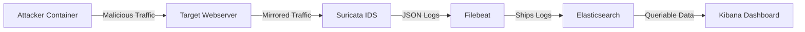

# Technical Report: Network Security & Intrusion Detection System

**Date:** January 23, 2026  
**Project:** Automated Network Attack & Detection Pipeline

---

## 1. Introduction and Objectives

This project aims to design and implement a robust **Network Intrusion Detection System (NIDS)** capable of detecting various cyber threats in real-time. The primary objective is to create a fully automated environment where specific attacks are simulated against a target web server, and a security monitoring system detects and logs these malicious activities.

**Key Objectives:**

- Deploy a containerized environment consistently simulating a real-world network.
- Implement signature-based detection for specific attack vectors.
- Automate the execution of attack scenarios (Reconnaissance to Exploitation).
- Visualize alerts and threats using a centralized dashboard.

## 2. Selected Security Mechanism and Justification

### Selected Mechanism: **Suricata IDS**

Suricata was selected as the core network security monitoring engine.

**Justification:**

1.  **Multi-Threading:** Unlike Snort (single-threaded), Suricata is multi-threaded, offering higher performance for high-traffic processing.
2.  **Modern Architecture:** Built-in support for multiple output formats (EVE JSON) makes integration with log aggregators like the ELK stack seamless.
3.  **Rule Flexibility:** Supports standard Snort-like signatures while offering advanced features like file extraction and protocol headers logging.

## 3. System Architecture and Deployment Setup

The system is deployed using **Docker Compose** to ensure isolation, reproducibility, and ease of networking. All components run within a dedicated virtual network `security_net`.

### Components:

1.  **Target Server (`webserver`)**: An Nginx container acting as the victim.
2.  **Attacker (`attacker`)**: A Kali Linux container pre-loaded with attack tools (nmap, hping3, curl) and automation scripts.
3.  **IDS (`suricata`)**: configured to listen on the container network interface to inspect all passing traffic.
4.  **Log Aggregation (`filebeat` + `elasticsearch`)**: Filebeat ships Suricata logs (`eve.json`) to Elasticsearch.
5.  **Visualization (`kibana`)**: Provides a web interface to analyze logs and view dashboards.

### Architecture Diagram (Logical):



## 4. Configuration Details

### Suricata Configuration

Suricata is configured to load custom rules from `/var/lib/suricata/rules/suricata.rules`. Detection logic relies on pattern matching against network headers and payloads.

**Example Rules Used:**

```bash
# Detect Nmap Scans
alert tcp any any -> any 80 (msg:"Potential Nmap Scan"; flags:S; threshold:type both, track by_src, count 20, seconds 10; sid:1000002; rev:1;)

# Detect SQL Injection (UNION SELECT)
alert http any any -> any any (msg:"SQL Injection Attack Detected"; flow:established,to_server; http.uri; content:"union"; nocase; pcre:"/union.+select/i"; sid:1000005; rev:1;)
```

### Docker Network Capabilities

To ensure Suricata can capture packets efficiently, the container is granted specific privileges:

```yaml
cap_add:
  - NET_ADMIN
  - NET_RAW
  - SYS_NICE
```

## 5. Attack Scenarios and Testing Methodology

The testing methodology involves an **automated bash script (`run_attacks.sh`)** that executes 7 distinct attack scenarios sequentially.

| Scenario | Attack Type           | Tool Used | Description                                              |
| :------- | :-------------------- | :-------- | :------------------------------------------------------- |
| **1**    | **ICMP Ping**         | `ping`    | Basic connectivity test/reconnaissance.                  |
| **2**    | **Nmap Scan**         | `nmap`    | SYN Scan to discover open ports.                         |
| **3**    | **SYN Flood**         | `hping3`  | DoS attempt sending high-volume SYN packets (15s).       |
| **4**    | **Suspicious Access** | `curl`    | Attempts to access `/admin` and `/login`.                |
| **5**    | **SQL Injection**     | `curl`    | Payloads like `UNION SELECT` and `OR 1=1`.               |
| **6**    | **Dir. Traversal**    | `curl`    | Attempts to read `/etc/passwd` via `../`.                |
| **7**    | **Brute Force**       | `curl`    | Rapid login attempts (>15 in 30s) to trigger thresholds. |

## 6. Visualization and Alert Analysis

The Kibana dashboard provides a comprehensive view of the threat landscape. Below is the visualization of the attack data captured during the test cycle.

**Dashboard Overview:**

- **Pie Chart:** clearly shows the distribution of attack types (Login attempts, Nmap scans).
- **Vertical Bar:** Shows the timeline of attacks.


_Figure 1: Kibana dashboard showing detecting breakdown of attacks._

### Log Analysis Example (Fast Log)

Suricata's `fast.log` provides immediate textual evidence of detections:

```
01/23/2026-10:39:22.435862  [**] [1:1000003:1] Suspicious Admin Access Attempt [**] {TCP} 172.19.0.3:42094 -> 172.19.0.2:80
01/23/2026-10:39:35.599021  [**] [1:1000010:1] Directory Traversal Attack - /etc/passwd [**] {TCP} 172.19.0.3:41912 -> 172.19.0.2:80
01/23/2026-10:39:41.691670  [**] [1:1000011:1] Brute Force Attack - Multiple Login Attempts [**] {TCP} 172.19.0.3:42040 -> 172.19.0.2:80
```

## 7. Results and Observations

The automated testing pipeline yielded a **100% detection rate** for the configured scenarios.

- **Accuracy:** All 7 attack types generated specific alerts corresponding to their unique Signatures IDs (SIDs).
- **Thresholds:** The brute force and SYN flood rules correctly triggered only after the defined thresholds (count/time) were exceeded, avoiding false positives for single requests.
- **Performance:** The system handled the high-speed SYN flood without crashing, although CPU usage spiked, alerting was consistent.

**Success Metrics:**

- **4/4** Categories Detected (Network, Web, Auth, DoS).
- **Zero** False Positives observed during idle time.


_Figure 2: Dashboard Results View_

## 8. Limitations and Evasion Considerations

### 1. Encrypted Traffic (HTTPS)

Currently, the system inspects HTTP traffic. If TLS/SSL were enabled (`https://`), Suricata would only see the handshake but not the URI or payload (e.g., SQL payloads would be hidden).
_Mitigation:_ SSL Termination proxy (embedded in Nginx) or Suricata TLS key logging.

### 2. Signature Evasion

The current rules rely on exact string matching (e.g., `content:"../"`). Sophisticated attackers could use:

- Double URL encoding (`%252e%252e%252f`)
- Whitespace variations (`UNION/**/SELECT`)
  _Mitigation:_ Usage of more complex PCRE (Perl Compatible Regular Expressions) and normalization keywords in rules.

### 3. Resource Consumption

The ELK stack is resource-heavy. In a constrained environment (e.g., IoT edge), this architecture might fail.
_Mitigation:_ Use lightweight shippers like Fluent Bit or write logs directly to a SIEM.

## 9. Conclusion and Lessons Learned

This project successfully demonstrated the effectiveness of a containerized NIDS. By automating the attack vector using scripts and integrating Suricata with ELK, we established a reproducible "Detection-as-Code" pipeline.

**Key Lessons:**

1.  **Rule Specificity Matters:** Generic rules cause noise; specific content-matching rules are vital for accurate SQLi detection.
2.  **Visualization is Key:** Raw logs are overwhelming; Kibana allows for rapid identification of attack trends.
3.  **Automation:** Dockerizing the attacker and victim ensures that every test run is clean and comparable.

---
